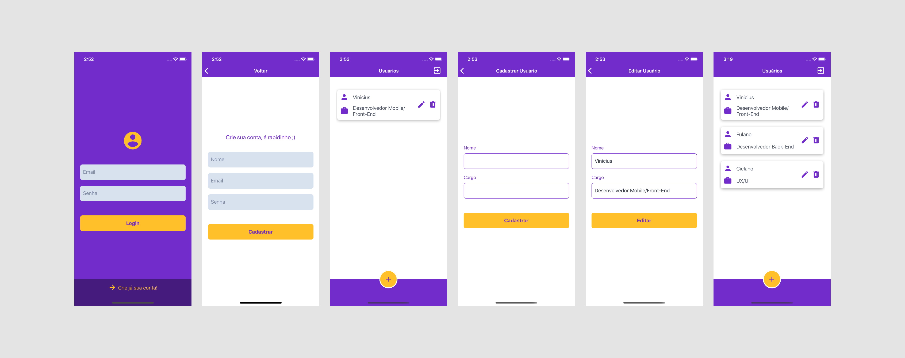

# CRUD simples para estudos
 
Esse projeto tem como objetivo a aplicação dos últimos conceitos estudados, se trata de um cadastro de Funcionários, contendo nome e profissão.
 
### Tecnologias utilizadas
 
Aplicativo feito em React-Native com integração ao firebase.
 
### Ferramentas Utilizadas

  - Firebase
    - Autenticação
    - Banco RealTime.
  
  - React-Navigation
    - StackNavigation.
 
  - ContextApi
    - Responsável por todo gerenciamento da Autenticação e dos Métodos
 
 
### Aplicação (Telas)
 

 
### Contato
- https://www.linkedin.com/in/vinicius-n-sales/

